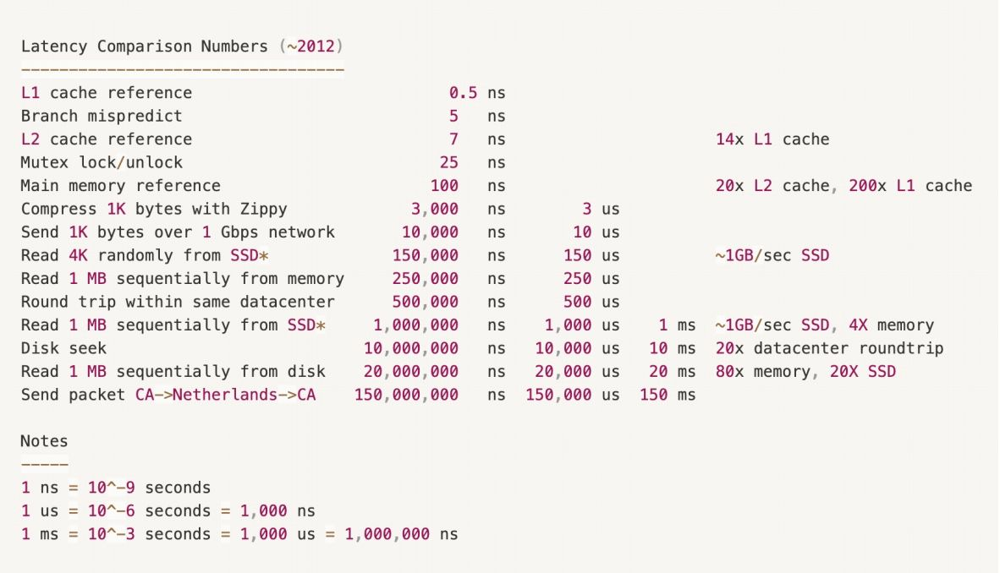

# 并发问题

PHP-FPM 的一个主要问题是它与进程绑定连接，每个进程都相当臃肿，它
无法扩展处理大量的并发请求。  
想象一下，100 个请求同时进来，就要用 100 个进程来服务这些请求。
除此之外，还会有 100 个连接建立到你的数据库，因为不可能在这些请求
中重复使用连接。  
理论上，如果 PHP 进程能在固定的、有限的时间内完成执行，比如脚本只
返回 "Hello world"。这并不是什么大问题，因为只有 CPU 的计算，PHP 进
程可以很快的返回。  

但在现实世界中，现代 Web 应用总是涉及到外部 I/O 操作，如调用数据
库、调用远程的 OAuth 的 HTTP API 以及其他昂贵的外部操作发送邮件
等。这些外部 I/O 等待的时间有时是无法控制的，甚至会因为很多原因而失
败。所以，有很多进程只是在等待 I/O，却没有对服务器进行任何有用的操
作。  
让进程异步化是解决这个并发问题的总体思路。

## 快速组件和慢速组件
在实践世界中，并发问题来自于一个应用或系统的每个组件运行速度不一
样：内存访问快，磁盘访问慢，本地网络快，远程网络慢，CPU 快，但 I/O
慢。

## 并发模型

Swoole 服务器使用的并发模型是通过在一个进程中使用多个 coroutine，与
多进程和 CSP 模型混合。不同的进程也可以与 Swoole Table 共享全局数
据。我们将在其他章节中向您介绍 CSP 模型在 PHP 语言中与 Swoole
coroutine 和 Swoole channel 的工作原理。